# 👟 Disaster Wash Shoes

<p align="center">
  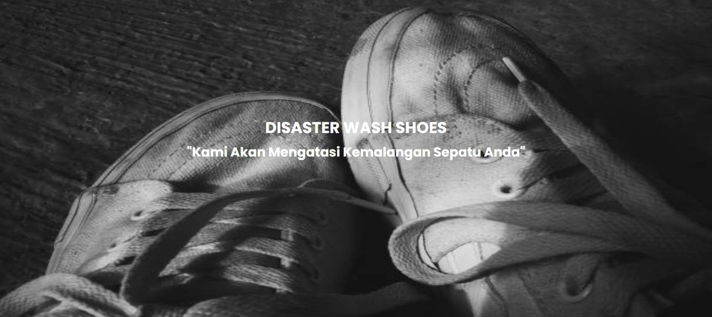
</p>

<p align="center">
  
  
  
  
</p>

### Web-Based Shoe Cleaning Service Management System

Disaster Wash Shoes is a web-based shoe cleaning service management system developed using PHP Native and MySQL. The application helps streamline shoe cleaning service operations by providing online ordering, payment management, customer reviews, and administrative management features in a single integrated platform.

---

# 📖 Project Overview

This website was developed to digitize shoe cleaning service operations and improve customer experience through an online ordering system.

### Main Objectives

* Simplify customer registration and ordering processes
* Manage service packages efficiently
* Record customer transactions digitally
* Monitor orders through an admin dashboard
* Store customer reviews and service feedback

---

# ✨ Features

## 👤 Customer Features

* User Registration
* User Login
* View Service Information
* Place Shoe Cleaning Orders
* Submit Payment Information
* View Order History
* Submit Reviews
* Logout

## 🔐 Admin Features

* Admin Login
* Dashboard Monitoring
* Manage Customer Data
* Manage Orders
* Manage Transactions
* Manage Service Packages
* Manage Shoe Types
* Manage Payment Methods
* Manage Admin Accounts

---

# 🛠️ Tech Stack

### Backend

* PHP Native

### Database

* MySQL

### Frontend

* HTML5
* CSS3
* Bootstrap
* JavaScript

### Development Tools

* XAMPP
* phpMyAdmin
* Visual Studio Code
* Git
* GitHub

---

# 📂 Project Structure

```text
shoes/
│
├── admin/                     # Administrator module
│   ├── dashboard.php          # Admin dashboard
│   ├── admin.php              # Manage admin accounts
│   ├── pelanggan.php          # Manage customer data
│   ├── pesanan.php            # Manage customer orders
│   ├── transaksi.php          # Manage payment transactions
│   ├── data_paket.php         # Manage service packages
│   ├── jen_sepatu.php         # Manage shoe categories
│   ├── met_bayar.php          # Manage payment methods
│   └── function.php           # Database connection and helper functions
│
├── database/
│   └── shoes.sql              # Application database
│
├── foto_layanan/              # Service images
│
├── index.php                  # Landing page
├── home.php                   # Customer home page
├── loginPeng.php              # Customer login
├── regisPeng.php              # Customer registration
├── order.php                  # Order form page
├── pesanPeng.php              # Order processing
├── bayarPeng.php              # Payment page
├── riwayat.php                # Order history page
├── riviewPeng.php             # Customer review page
├── logoutPeng.php             # Logout process
├── hapusPesanan.php           # Delete order process
│
└── README.md                  # Project documentation
```

---

# 🗄️ Database Design

Database Name:

```sql
shoes
```

Main Tables:

| Table          | Description                       |
| -------------- | --------------------------------- |
| data_admin     | Stores administrator data         |
| data_pelanggan | Stores customer information       |
| data_pesanan   | Stores customer orders            |
| data_transaksi | Stores payment transaction data   |
| layanan        | Stores available service packages |
| data_jenis     | Stores shoe categories            |
| metode_bayar   | Stores payment methods            |
| data_riview    | Stores customer reviews           |

---

# 🔄 System Flow

## Customer Flow

1. Register an account
2. Login
3. Select service package
4. Submit order information
5. Complete payment
6. Wait for order processing
7. View order history
8. Submit review

## Admin Flow

1. Login as administrator
2. Manage service packages
3. Manage shoe categories
4. Manage customer data
5. Manage orders
6. Manage transactions
7. Monitor system activities

---

# 🚀 Installation Guide

## 1. Clone Repository

```bash
git clone https://github.com/username/disaster-wash-shoes.git
```

## 2. Move Project

Place the project folder inside:

```text
xampp/htdocs/
```

## 3. Create Database

Open phpMyAdmin and create a new database:

```text
shoes
```

## 4. Import Database

Import the SQL file:

```text
database/shoes.sql
```

## 5. Configure Database Connection

Open:

```php
admin/function.php
```

Update database configuration:

```php
$host = "localhost:8111";
$user = "root";
$pass = "";
$db   = "shoes";
```

## 6. Run Application

Start:

* Apache
* MySQL

Open browser:

```text
http://localhost/shoes
```

---

# 📸 Application Screenshots

## Landing Page

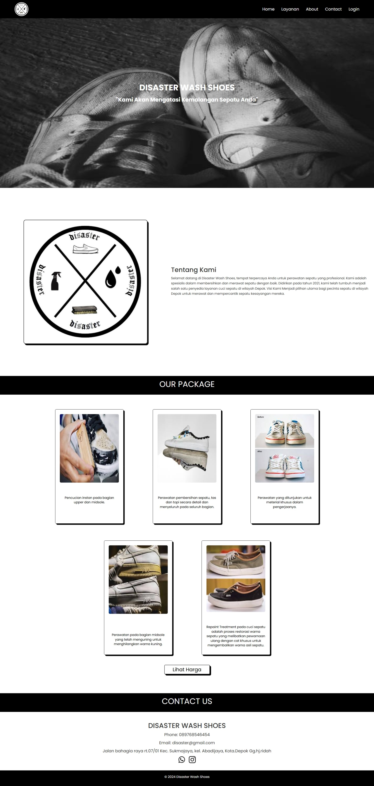

## Customer Login

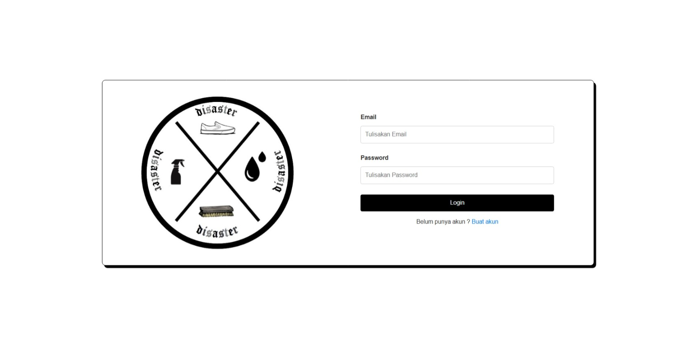

## Registration

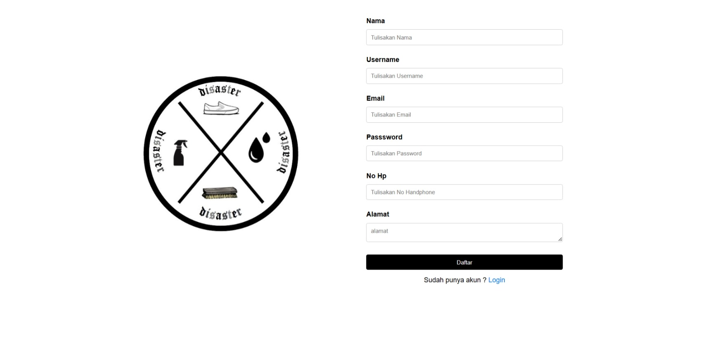

## Home Page


## Order Page

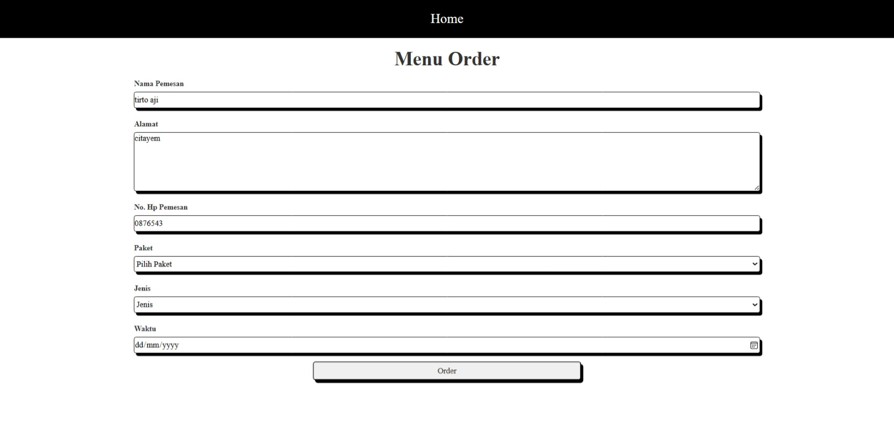

## Payment Page

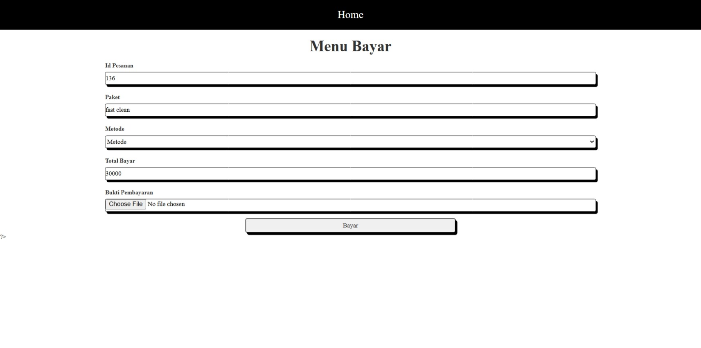

## view orders

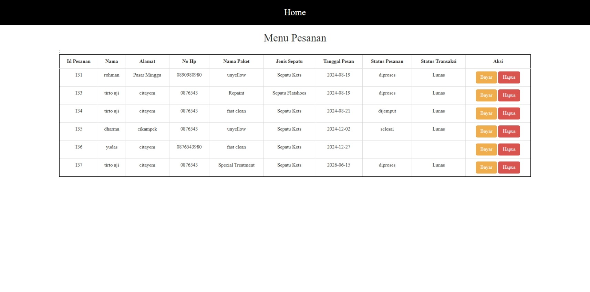

## Review Page


## Admin Dashboard

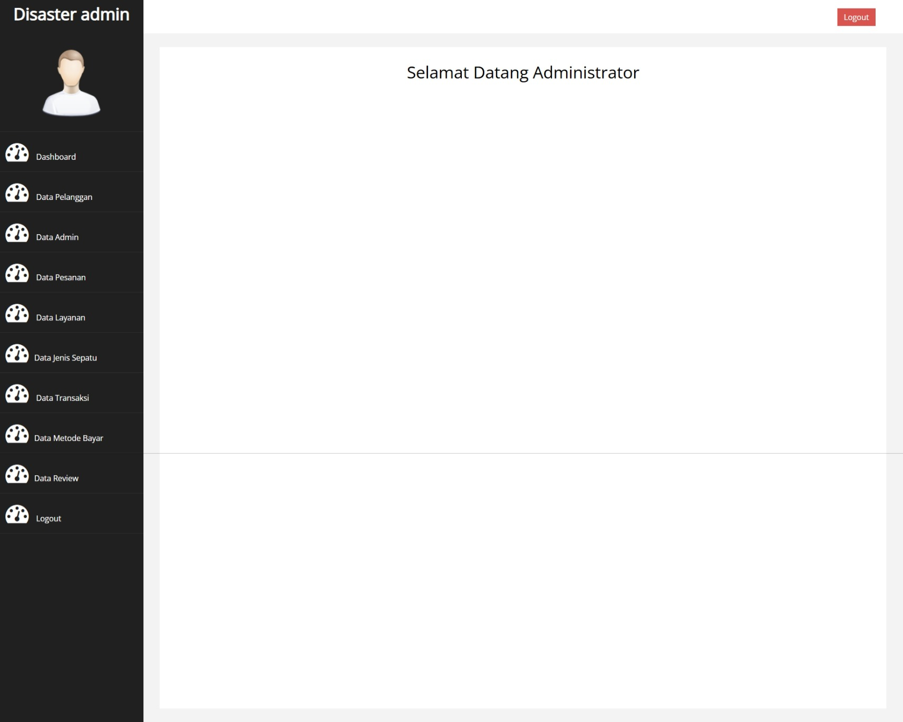

## Manage Orders

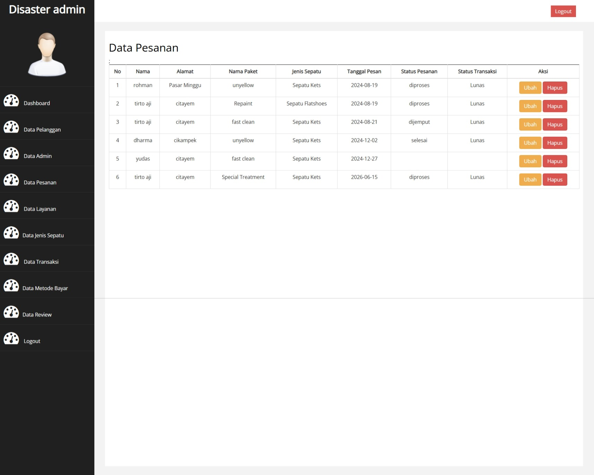

## Manage Customers

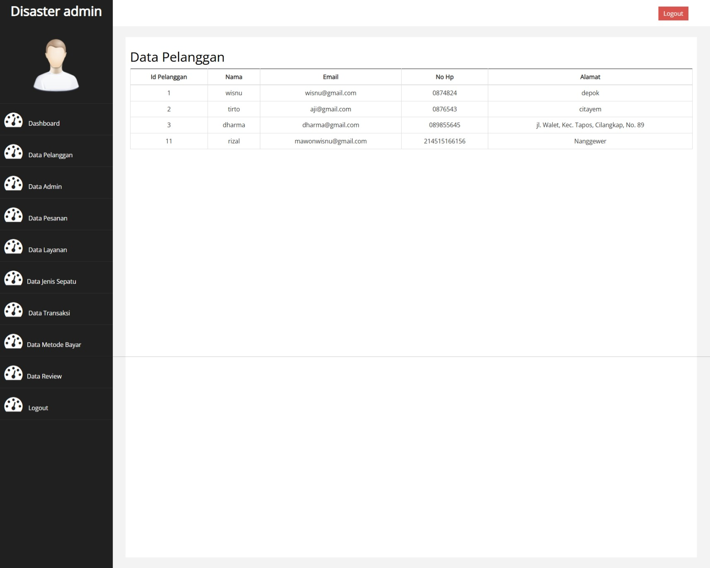

## Manage Services

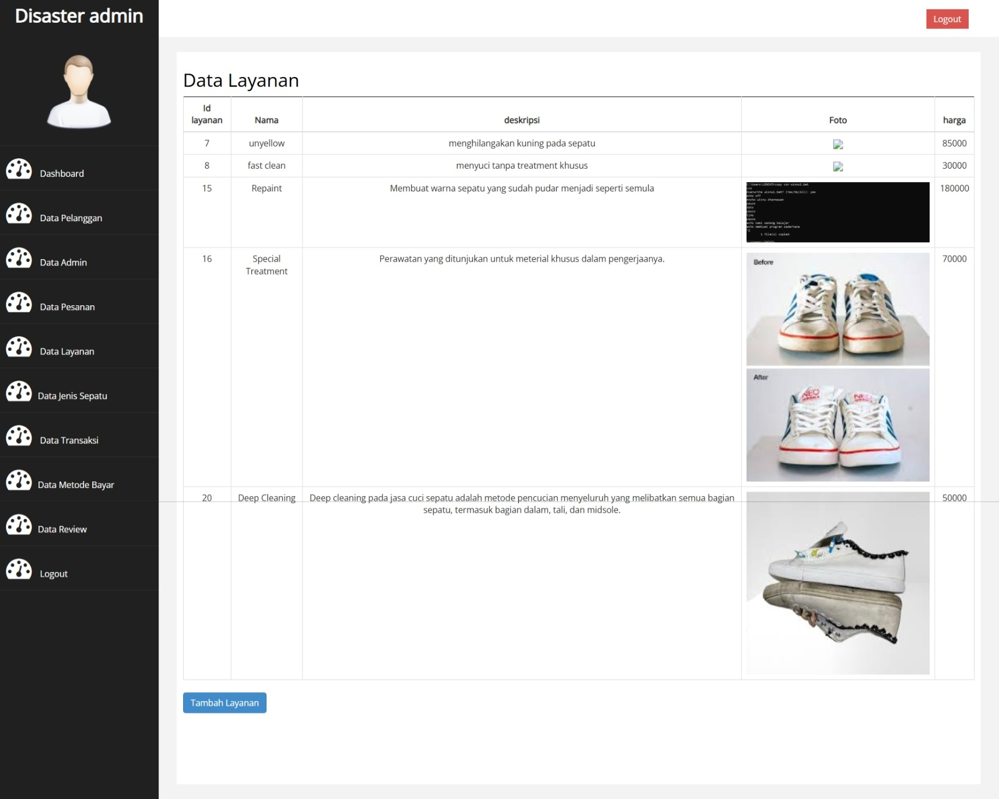

---

# 👨‍💻 Author

**Wisnu Dharmawan**

Information Systems Graduate

### Skills

* PHP
* MySQL
* HTML
* CSS
* Bootstrap
* JavaScript

GitHub: https://github.com/wdharmawan

LinkedIn: https://linkedin.com/in/yourprofile

---

# 📄 License

This project was developed for educational purposes and portfolio demonstration.
